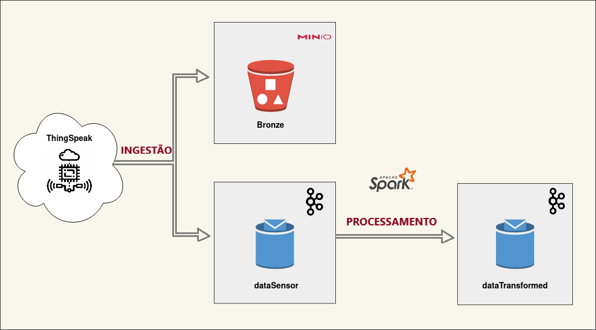
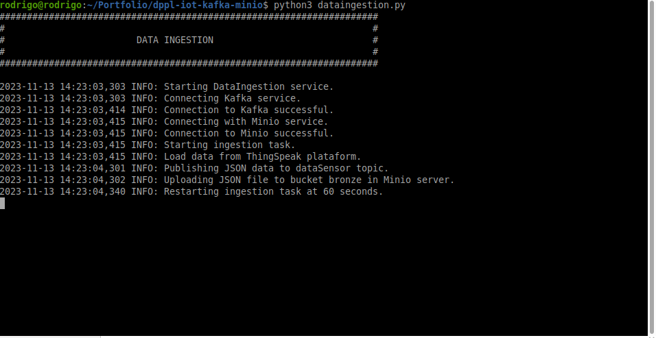
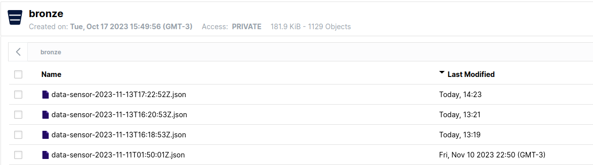
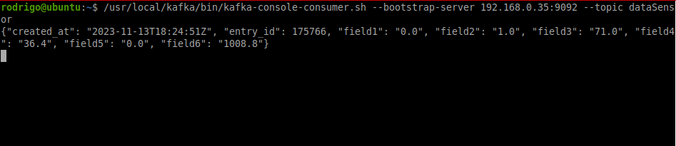
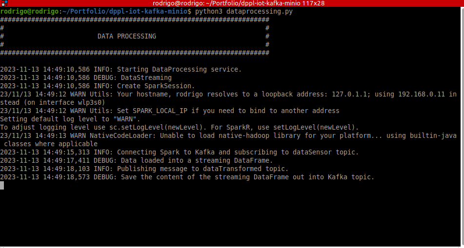
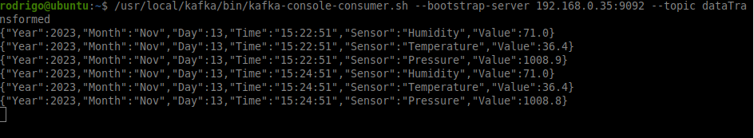

# Pipeline de dados com o processamento de dados em streaming de uma plataforma IoT

###  Apresentação

Neste projeto, buscou-se elaborar um pipeline de dados básico com processamento em streaming de variáveis meteorológicas coletadas de uma plataforma IoT chamada ThingSpeak. 

### Diagrama do Projeto

    

### Tecnologias, linguagens e pacotes utilizados

- Python v3.10.12
- Apache Spark v3.5.0
- Kafka v3.5.1
- Minio RELEASE.2023-10-16T04-13-43Z
- VirtualBox v7.0
- Docker v24.0.2
- Pacotes para o Apache Spark:
  - jets3t-0.9.4.jar
  - aws-java-sdk-1.12.571.jar
  - aws-java-sdk-bundle-1.12.571.jar
  - kafka-clients-3.5.0.jar
  - spark-sql-kafka-0-10_2.12-3.5.0.jar
  - spark-token-provider-kafka-0-10_2.12-3.5.0.jar
  - commons-pool2-2.12.0.jar

### Etapas

A construção do projeto proposto ocorreu em 5 etapas:

1. Construção de um ambiente local
2. Implantação do serviço de storage local de objetos
3. Implantação do serviço de storage de dados em streaming
4. Aquisição e Ingestão de dados da plataforma IoT no Minio e Kafka
5. Processamento dos dados em streaming

#### 1. Construção de um ambiente local

Visando o reforço nos conhecimentos de Sistema Operacional Linux, Redes de Computadores e Virtualização, criou-se uma infraestrutura local com o uso de duas máquinas virtuais pelo VirtualBox. 

Uma máquina virtual atua como serviço de storage de objetos com o Minio e outra como serviço de streaming de dados com o Kafka.

Configuração das máquinas virtuais:

* SO: Ubuntu Minimal 18.08 configurado como servidor básico
* RAM: 2 GB
* HD: 30 GB
* Interface de Rede: modo bridge

Configuração da máquina hospedeira:

* SO: Linux Mint v21.1
* CPU: Core i7 8 núcleos
* RAM: 20 GB

#### 2. Implantação do serviço de storage local de objetos

O [MinIO](https://min.io/) foi escolhido como serviço de storage de objetos on-premises. Sua escolha se deu pela simplicidade de uso bem como pela similaridade em nível de programação com o ambiente do AWS S3 o que contribúi também para o processo de estudo de ferramentas e conceitos.

Ele foi implantado em uma das máquinas virtuais como um container Docker e possui um bucket:

* Bronze

Um arquivo **docker-compose-files/docker-compose-minio.yml** foi usado para criar um container contendo o Minio.

#### 3. Implantação do serviço de storage de dados em streaming

O [Kafka](https://kafka.apache.org/) foi a plataforma escolhida para armazenar os dados em tempo real coletados da plataforma ThingSpeak. 

Assim como o Minio, ele também foi implantado como um container Docker em uma máquina virtual. 

Criou-se 2 tópicos no Kafka:

* **dataSensor:** Tópico usado para publicar no Kafka os dados coletados da plataforma.
* **dataTransformed:** Tópico usado para públicar no Kafka os dados que foram processados pelo Apache Spark.

Um arquivo **docker-compose-files/docker-compose-kafka.yml** foi usado para provisionar o container com o Kafka.

**Observação:**

Como, neste ambiente proposto, o container Kafka está em uma máquina virtual, então foi preciso informar o endereço IP local atribuído a ela. Esta informação está presente na linha 22 do arquivo *docker-compose-files/docker-compose-kafka.yml*:

~~~
KAFKA_ADVERTISED_LISTENERS: PLAINTEXT://kafka:29092,PLAINTEXT_HOST://192.168.0.35:9092
~~~

#### 4. Aquisição e Ingestão de dados da plataforma IoT no Minio e Kafka

Esta etapa ocorre pela execução do script **dataingestion.py** sendo ele executado localmente na máquina hospedeira das máquinas virtuais. 

Como fonte de dados, escolheu-se dados de natureza em tempo real obtidos de uma aplicação de IoT hospedada na plataforma ThingSpeak. Nela, as aplicações são definidas como canais (Channels) que podem ser privados ou públicos. 

Escolheu-se o [Channel ID: 1052510](https://thingspeak.com/channels/1052510) por representar dados coletados de uma estação meteorológica particular instalada na cidade de Belém-PA. As variáveis definidas foram:

* Timestamp
* Umidade relativa do ar (%rH)
* Temperatura do ambiente (Celsius)
* Pressão Atmosférica (mBar)

Em relação à ingestão dos dados, ela segue as seguintes sequências:

1. Dados requisitados e recebidos em formato JSON.
2. Geração de arquivo em formato JSON sendo armazenado em um diretório local temporário (*raw_data*).
3. Arquivo JSON presente no diretório temporário é enviado ao bucket Bronze no Minio.
4. Dados em formato JSON são publicados como mensagens para o tópico dataSensor no Kafka.
5. As etapas de 1 a 4 se repetem a cada x segundos.

O arquivo **config/params.yml** determina os principais parâmetros necessários para a execução deste script, inclusive o parâmetro **schedule_time** que define o intervalo de repetição deste processo, em segundos. 

A figura abaixo apresenta a execução do script de aquisição e ingestão de dados.

    

Já a figura abaixo apresenta uma amostra do conteúdo presente no bucket Bronze. 

    

Por fim, a figura abaixo apresenta os dados já publicados no tópico **dataSensor**.

    

**Observação:** 

Os dados coletados da aplicação no ThingSpeak dependem da disponibilidade  por parte do proprietário que pode tornar indisponível o acesso a aplicação por motivos próprios ou não. 

#### 4. Processamento dos dados em streaming

Esta etapa ocorre pela execução do script **dataprocessing.py** sendo ele executado localmente na máquina hospedeira das máquinas virtuais. Necessitando ser executado em conjunto com o script **dataingestion.py**.

Os dados brutos publicados como mensagens no tópico dataSensor são consumidos neste mésmo tópico pelo Apache Spark e então passam por algumas transformações:

* Mudança de nome de colunas.
* Ajuste de tipo de dado.
* Definição de Schema.
* Criação de colunas referentes a ano, mês, dia e hora da coleta do dado pelo sensor.
* Alteração do mês em formato de número para o formato de caractere.
* Transformação do formato do dataframe.

Após isto, eles são públicados no Kafka como mensagens no tópico **dataTransformed**. Assim, as aplicações podem usar essas informações para gerar possíveis alertas relacionados a umidade relativa do ar ou alta/baixa temperatura do ambiente.

A figura abaixo apresenta a execução do script de processamento dos dados em streaming.

    

Já a figura abaixo apresenta os dados já transformados e publicados no tópico **dataTransformed**.

    

**Observação:** 

As credenciais de acesso armazenadas na variável **minio_lib** presente no arquivo *config/credentials.py* devem ser criadas através do ambiente de gerenciamento do Minio.

### Conclusão

Este projeto teve como objetivo reforçar diversos conceitos bem como ter contato com outros principalmente no contexto de "dados". Por ser um cenário local e genérico também permite estudar e aplicar outros conceitos e ferramentas como:

* Apache AirFlow
* Apache Kafka
* Uso de buckets silver e gold
* Kubernetes
* Elaboração de dashboards com dados em tempo real
* ...

